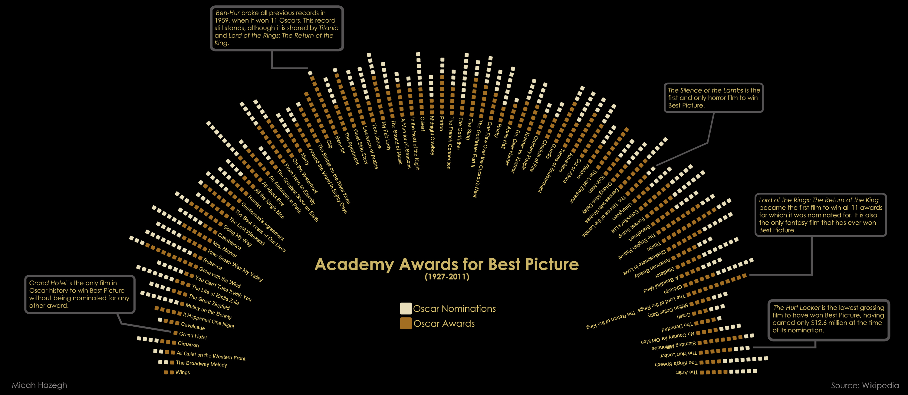

After having done several visualizations using my own data, I thought it was time to branch out to a public data set. I made some changes to an algorithm I used to visualize awards won by movies I own and applied it to films that have won the Oscar for best picture. The result showed interesting moments in Oscar history, some of which I make note of in the graphic.

