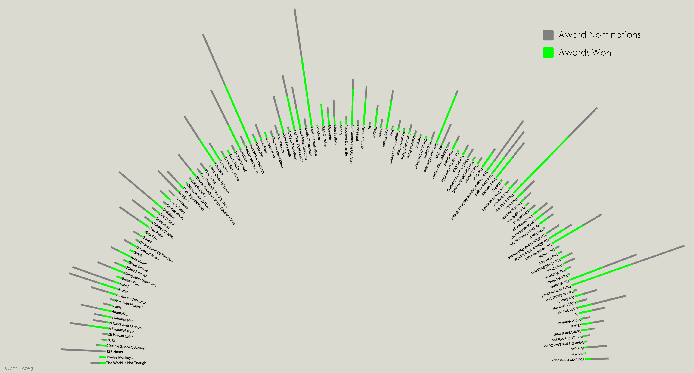

A different interpretation of my movie collection, this time showing award data for each movie. The grey bars along the perimeter of half-circle represent the number of nominations each movie has received, and the green bars represent how many awards each movie has won. Award data for each movie was fetched using The Freebase API.

