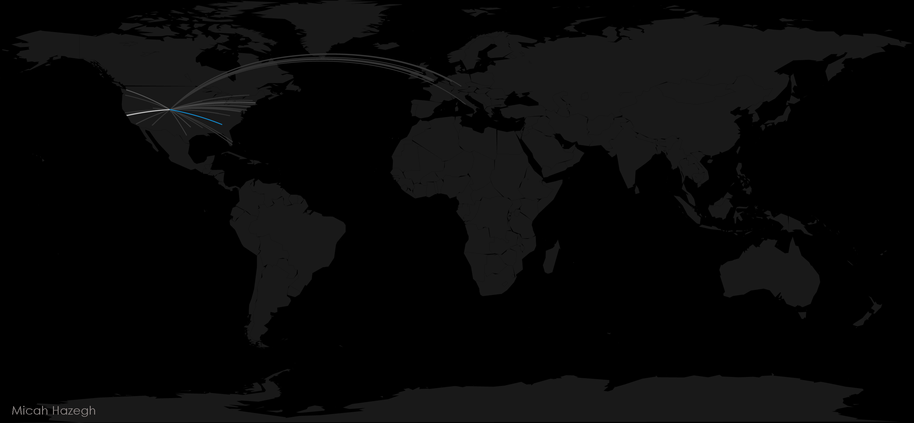

This is a map of my browser history over the course of one week. Each line represents a connection from my location (Denver,CO) to the latitude-longitude point a given website was traced to. The colors of the lines range from gray to white to blue, with blue representing the highest number of visits.

To get my browser history in an accessible format I used the History Export add-on in Firefox to convert my history into a JSON message. Then I wrote a python script which parses and cleans the urls, as well as fetches the IP addresses associated with each.

Once I had a list of IP addresses for each website, I collected the latitude-longitude points by using the IP Address Geolocation API. After customizing R code from Flowing Data to fit my data, the points were mapped and connected using great circle routes.

