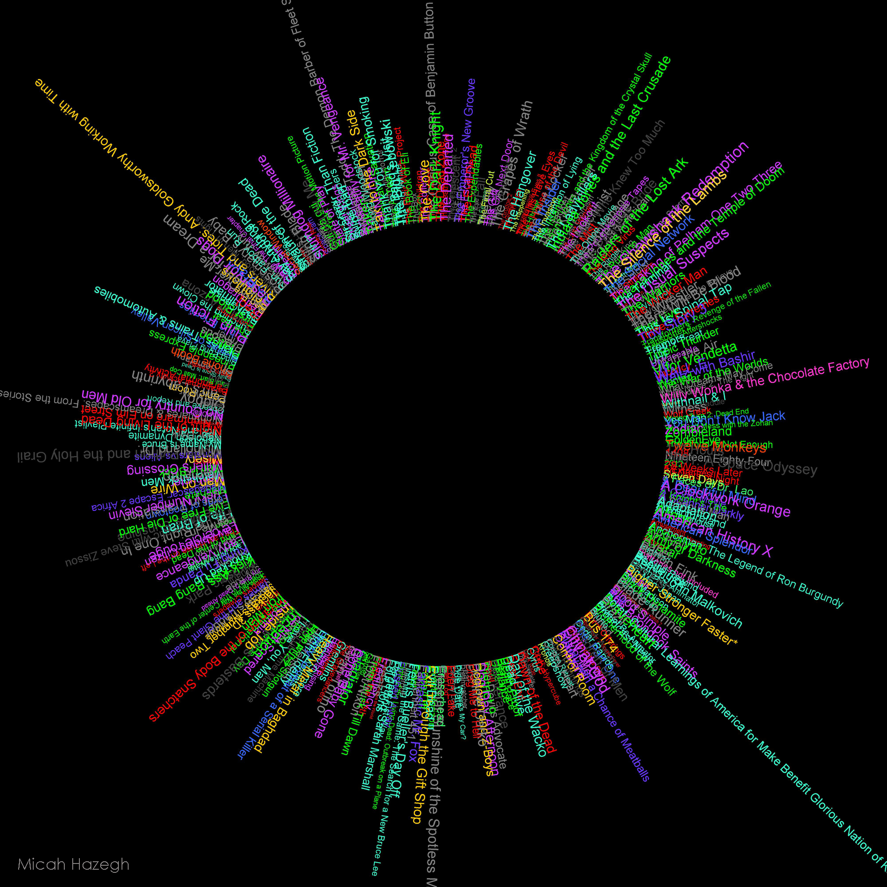
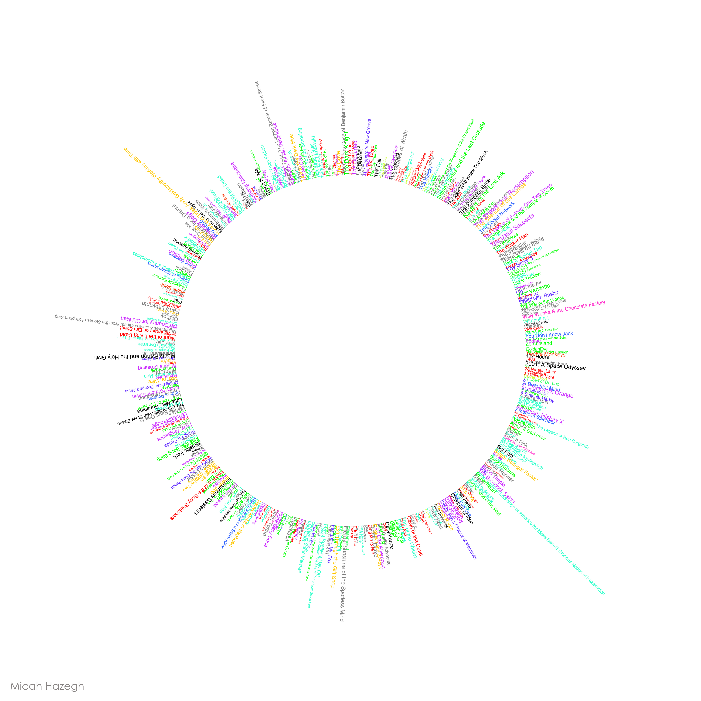
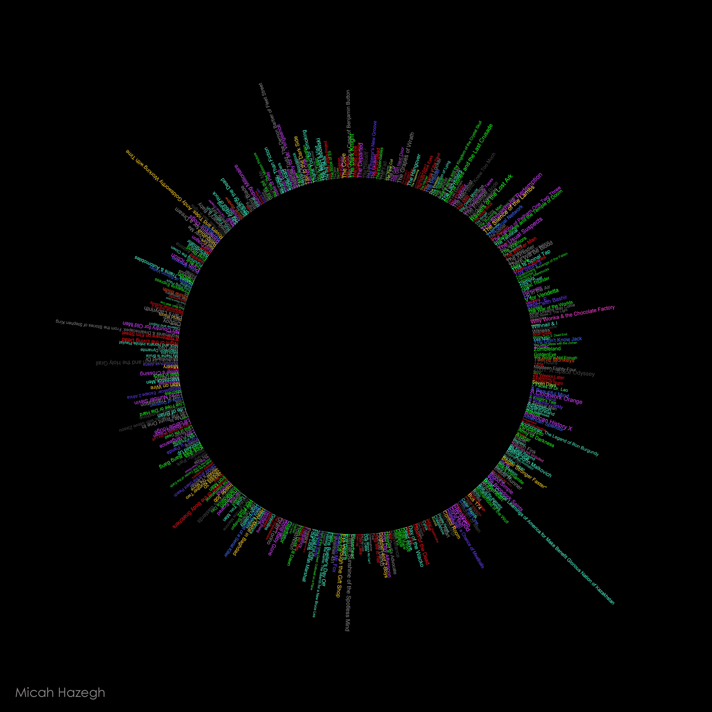

A circular visualization of my movie collection. Ratings and genres of each movie were fetched using The IMDB API and a quick Python script. From there I wrote a Java program to parse the data and arrange the movie titles in a circle. The size of the titles is determined by their IMDB rating (larger text means better rating), and the color of each title depends on their genre.

 
 
