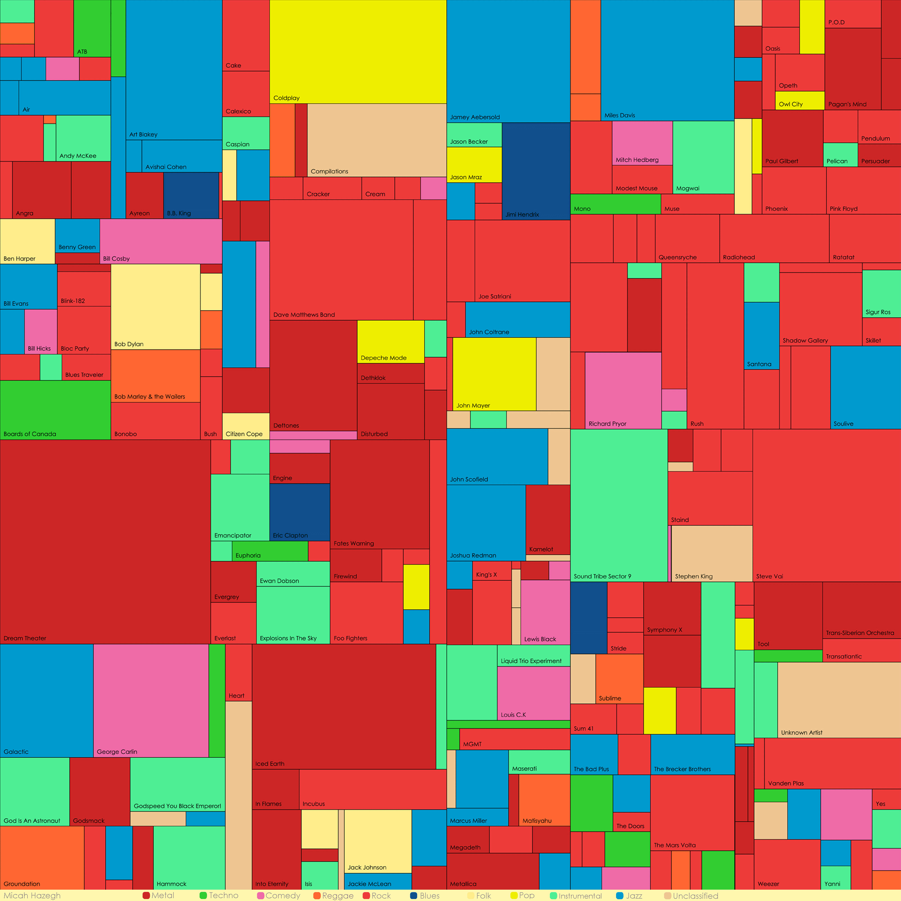

After visualizing my movie collection, I thought it would be neat to do something similar for my music collection. I chose to create a treemap of my music files where each shape represents a band. The size of a shape reflects how much music I have from that band, and the color is the band's musical genre. I was able to fetch the genre for each artist using The Freebase API and a little Python magic.

